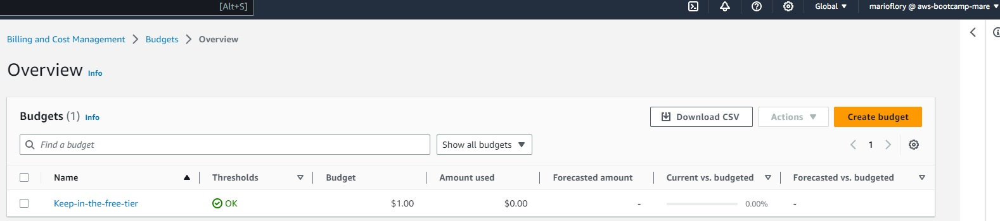
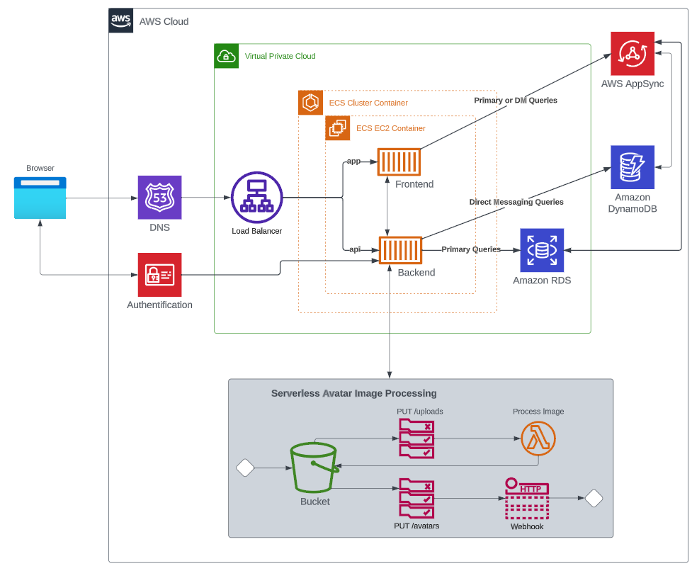

# Week 0 — Billing and Architecture
# CloudShell commands:

Enable auto-completion, called auto-prompt. Shows possible commands as a preview, use TAB to accept proposed commands

`aws --cli-auto-prompt`

`aws sts` stands for "Security token service"

# Gitpod usage:

Print environment variables using `env`

Show the $PATH environment variable: `echo $PATH`

Use the aws CLI from within Gitpod after installing it: `aws sts get-caller-identity`

This will generate an error if no credentials have been set in the environment variables.

Save environment variables inside gitpod: `gp env AWS_ACCESS_KEY_ID=defaultvalue`

# Homework

## Create a billing alarm
The limit of the alarm was set to 1 USD

## Recreate the napkin design of the video
[Link to the lucid charts napkin design made in my own account](https://lucid.app/lucidchart/5c707b25-8861-43e8-9741-636f2f4ca933/edit?viewport_loc=124%2C40%2C1817%2C1185%2C0_0&invitationId=inv_1eeefb0d-0f4f-43d7-9526-28d77f1688c3)

## Recreate the logical architecture diagram

Link to the lucid charts made in my own account:
[See here](https://lucid.app/lucidchart/4090bf4d-0a46-434b-b151-7833e2c0bb16/edit?viewport_loc=-576%2C85%2C3051%2C1456%2C0_0&invitationId=inv_db92fecd-dc38-4d88-b614-b11766b2b1bd)
